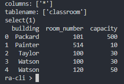
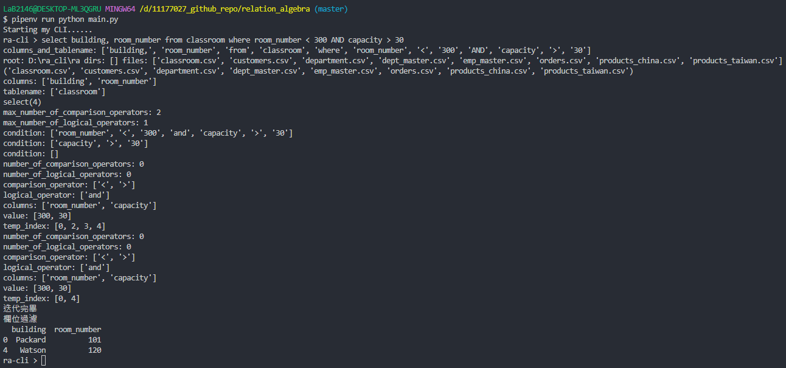
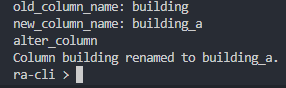
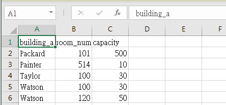
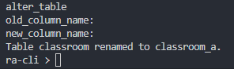
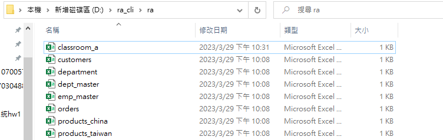
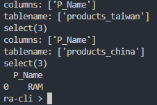
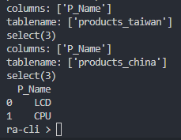
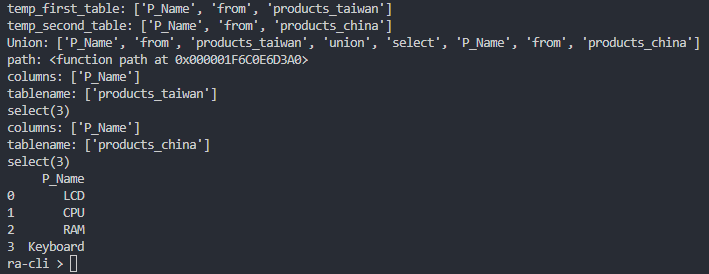
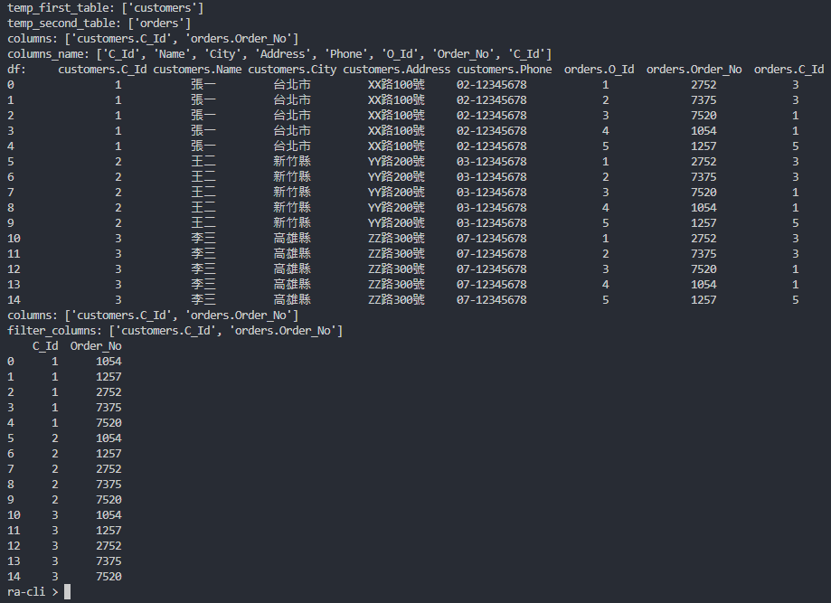

# 資料庫系統 HW #1

## 使用步驟

> 1. 首先執行 main.py
> 2. 執行後會在 D 槽建立一個 ra_cli 的資料夾，裡面有一個 ra 資料夾
> 3. 把 sample 資料夾裡面的.csv 檔案都放進 ra 資料夾裡
> 4. 開始用 SQL 語法

> [requires]
> python_version = "3.9"

> [packages]
> pandas = "_"
> click-shell = "_"
> click = "_"
> numpy = "_"

## Bug 待處理

1. 開頭的指令必須全部小寫，像是 select \* from classroom 的 select 必須全部小寫

## select

```
select * from classroom
```

### result:



## project

- 找 room_number < 300 且容量 > 30(只顯示 building 和 room_number 欄位):

```
  select building, room_number from classroom where room_number < 300 AND capacity > 30
```

### result:



## rename

- 修改 column 名稱:

```
alter table classroom rename column building to building_a
```

- 修改 table 名稱:

```
alter table classroom rename to classroom_a
```

### result:

修改 column 名稱(building 欄位名稱修改成 building_a):  
 

修改 column 名稱(classroom.csv 檔案):  
 

修改 table 名稱(classroom.csv 修改成 classroom_a.csv):  


修改 table 名稱(classroom_a.csv 檔案):  


## set_difference

```
select P_Name from products_taiwan except select P_Name from products_china
```

### result:



## set intersection

- 找在台灣地區和中國大陸地區都有的商品:

```
select P_Name from products_taiwan union select P_Name from products_china
```

### result:



## set_union

- 找台灣地區和中國大陸地區所有產品:

```
select P_Name from products_taiwan union select P_Name from products_china
```

### result:



## cartesian_product

```
select customers.C_Id, orders.Order_No from customers cross join orders
```

### result:



## show

- 顯示 ra 資料夾裡面所有 csv 檔案的 Dataframe:

```
show_schema
```

## clear

```
clear
```

- 清除 terminal 內容

## exit

```
exit
```

- 離開程式
